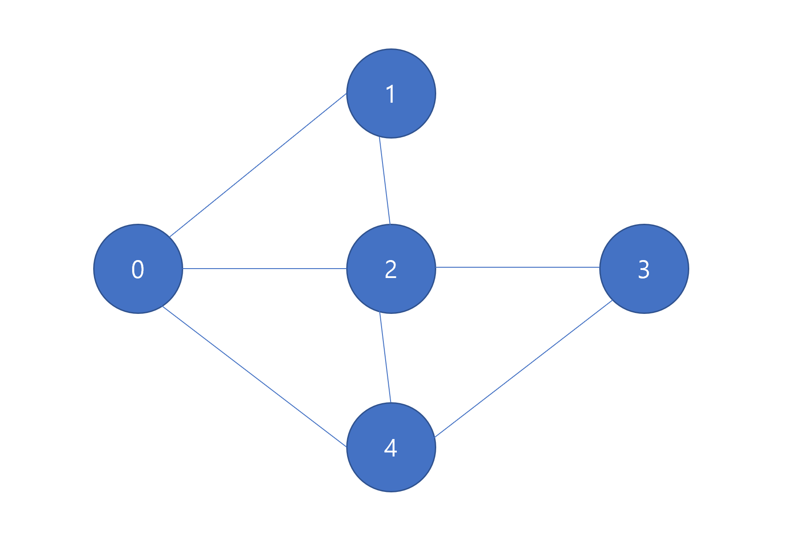

# Graph Basics 

#### 2020-05-29 

* 인천대학교 전경구 교수님 - 알고리즘

### 그래프 활용 
- 도로 표시 
- 인접한 영역을 그래프로 표시 (서로 연결이 되어 있음을 표시)
- 과목간의 선, 후수 관계 표시. A를 먼저 들어야 B를 들을 수 있다. 

### 그래프 용어 
- 정점 (Vertex, Node) 
- 간선 (Edge)

### 그래프의 종류 
- Undirected graph : 방향성이 없는 edge 로 이루어진 그래프  
- Directed graph : 방향성이 있는 (화살표로 가리키는 등) edge 로 이루어진 그래프
- Weighted graph : Edge 위에 10, 5, 11 과 같이 숫자 있는 것을 가중치라 한다. 
- Adjacent Vertex : A 의 adjacent vertex 는 B 와 C 이다 / C 의 adjacent vertex 는 A 이다. 

### Degree : Edge 의 개수 
- 들어오는 화살표 : In - degree 
- 나가는 화살표 : out - degree 

### Cycle 
- 경로를 이었을 때 출발과 도착이 같은 것 

### Complete graph 
- 모든 vertex 가 adjacent vertex 로 연결되어 있는 경우. 
- A - B, C, D 와 연결, B - C, D 와 연결, C - D 와 연결 된 경우. 
- 정점이 n 개 일 때, n*(n-1)/2 이다. 


### 그래프의 구현 
- 2차원 배열을 이용한다. 
- 그래프의 노드는 배열의 인덱스, 0 과 1 사이에 간선이 있다면 배열의 원소로 1을 넣고, 연결이 되어있지 않으면 0을 원소로 넣는다. 
- 방향성있는 그래프일 때에는 배열이 대칭성을 띄지 않는다. 행은 도착노드, 열은 시작 노드라고 생각하자. 
- 간선이 몇 개 없는 경우 2차원 배열로 표현하면 공간 낭비가 심해진다. 이를 극복하기 위한 방법이 Singly Linked List 를 사용하는 방법이다.


### 단일 연결 리스트로 그래프 표현하기 
- 0번 노드 -> 1번과 연결 -> 2번과 연결 -> … 
- 1번 노드 -> 0번과 연결 -> 2번과 연결 … 

* Edge 가 많을때는 단일 연결 리스트도 공간을 많이 차지하게 됨. 

### Edge 개수
- 많다 : dense graph 라고 한다. 2차원 배열
- 적다 : sparse graph 라고 한다. SLL 을 이용 (단일 연결 리스트)

* 하지만 꼭 위의 기준에 맞추기 보다는, 해결하려는 문제에 따라 알맞게 선택하자. DLL을 사용해도 되고, 다른 자료 구조를 사용해도 OK

### 코드 
* [2차원 배열로 그래프 표현하기](../src/com/gahee/algorithms/graph/GraphArray.java)
* [단일 연결 리스트로 그래프 표현하기](../src/com/gahee/algorithms/graph/GraphSLL.java) 


# DFS (Depth First Search) : 노드를 쭉 타고 들어간다! 

* 하나의 vertex 에서 시작하여 graph 의 모든 vertex 를 방문하는 알고리즘. 
    * 그래프의 모든 연결된 정점을 중복 없이 방문. 
* 두 가지 알고리즘 
    1. DFS : 깊이 위주로 검색 
    2. BFS (Breadth First Search) : 넓이 위주로 검색 
    
### DFS 
* 미로 찾기와 비슷하다. 
    * 길이 막히면 갈림길이 있었던 곳으로 돌아와서 다시 시작 
    * 스택을 이용한다. 
    
### Walk-through
* Visited array 를 두어서 방문한 곳을 표시한다. 
* Stack 은 막다른 길에 들어섰을 때 다시 돌아나오기 위해 사용한다. 
* 방문 -> 방문한 노드 배열에 체크 -> 스택에 방문한 노드 push, 
방문한 노드에서 더 이상 갈 곳이 없으면 stack pop  
    * 이렇게 뒤로 돌아가는 것을 back tracking 이라고 한다. 
    * pop한 노드도 배열 방문했다고 그대로 둔다.
* 이미 방문한 노드이면 다른 노드를 선택하도록 한다. 
* backtrack 과정 : 방문할 수 있는 곳이 더 이상 없으면 (배열에서 check 된 상태이면)
stack 에서 계속해서 pop 해준다. 
* 스택이 비었으면 종료한다. 


#### 2020-06-03

### Code 

```java
import java.util.Stack;

public class GraphDFS {
    private static final int NUM_VERTEX = 5;

    private Stack<Integer> stack = new Stack<>();
    private int [] visited = new int[NUM_VERTEX];
    private Node [] graph = new Node[NUM_VERTEX];
    
    ...

        
    private class Node{
        //본 클래스에서만 사용될 것이므로 private inner class 로 만들었다.
        int v;
        Node next;

        Node(int v, Node next){
            this.v = v;
            this.next = next;
        }
    }
```

* 필요한 자료구조 
  * 방문한 배열을 담을 visited array 
  * 노드들을 연결할 그래프를 위한 graph array 
  * 백트래킹을 위한 stack (Java 에서는 `java.util.stack` 을 사용하였다)
  * 노드를 표현할 Node class 


```java
//Node v1과 v2 를 연결한다.
public void addEdge(int v1, int v2, int doReverse){
    Node newNode = new Node(v2, null);
    Node curNode = graph[v1];

    if(curNode == null){
        graph[v1] = newNode;
    }else{
        //현재 노드의 다음 노드가 null 이 아닐때까지 탐색
        while(curNode.next != null){
            //다음 노드로 이동
            curNode = curNode.next;
        }
        //다음 노드가 null 이므로 마지막 노드이다.
        //새로운 노드를 마지막 노드의 다음 노드로 연결한다.
        curNode.next = newNode;
    }
    if(doReverse == 1){
        //v2 와 v1 을 연결한다.
        addEdge(v2, v1, 0);
    }
}
```

* 간선들을 연결할 메서드. 
* doReverse 를 이용해서 v1 - v2 연결, v2 - v1 연결 과정을 단순화 한다. 


```java
//현재 정점과 연결된 다음 노드를 찾는다.
public int findNextVertex(int v){
    Node curNode = graph[v];

    while(curNode != null){
        if(visited[curNode.v] == 0){
            return curNode.v;
        }
        curNode = curNode.next;
    }
    return -1;
}
```

* 그래프를 타고 들어가서 방문했던 노드인지 확인하고, 방문하지 않았으면 해당 노드를 반환한다. 


```java
//정점 v 로부터 탐색을 시작한다.
public void doDFS(int v){
    System.out.println("visited " + v);
    visited[v] = 1; //정점을 방문했다고 표시한다.
    stack.push(v); //일단 스택에 넣고 시작한다.

    //stack 이 비어있지 않을 동안
    while(!stack.isEmpty()){
        int nextVertex;
        nextVertex = findNextVertex(stack.peek());
        if(nextVertex == -1){
            //더 이상 stack 의 top 에 있는 것으로는 확인 불가.
            //갈 데가 없으므로 백트래킹
            stack.pop();
        }else{
            System.out.println("visited " + nextVertex);
            visited[nextVertex] = 1;
            stack.push(nextVertex);
        }
    }
}
```

* 스택의 맨 위에 있는 노드와 연결된 노드가 있는지 확인한다. 
  * 만약 있다면 해당 노드의 정점이 nextVertex 가 된다. 
  * 해당 노드를 방문하고, 해당 노드의 정점을 방문했다고 표시한다. 
  * 그리고 스택에 방문한 정점을 push 한다. 
* 만약 스택의 맨 위에 있는 노드와 연결된 모든 노드들을 방문했다면 
  * stack을 pop 한다. 
* stack 이 비어있지 않다면, 위의 과정을 스택이 빌 때 까지 반복한다. 


# BFS (Breadth First Search) : 노드의 주변을 먼저 탐색한 후 들어간다!

  

### Code 

```java
//넓이 우선 탐색을 진행한다.
public void doBFS(int v){
    queue.add(v); //방문한 정점을 큐에 넣는다.
    visited[v] = 1; //방문 했다고 표시한다.
    System.out.println("visited " + v);

    while(!queue.isEmpty()){
        //queue 의 front 와 연결된 간선이 있는가?
        int front = queue.poll();
        Node curNode = graph[front];

        while(curNode.next != null){
            curNode = curNode.next;
            //queue 의 front 와 연결된 정점들을 방문 했는가?
            if(visited[curNode.v] != 1){
                visited[curNode.v] = 1;
                queue.add(curNode.v);
                System.out.println("visited " + curNode.v);
            }
        }

    }
}
```

* Stack 대신 Queue 를 이용한다. 먼저 탐색했던 것과 연결된 정점이 있는지 확인한 후 그 다음 정점으로 넘어간다. 




* 위와같은 그래프를 만든다고 할 때의 BFS 의 결과는 다음과 같다. 

```
visited 0
visited 2
visited 4
visited 1
visited 3
```


#### 2020-06-04

# MST (Minimum Spanning Tree)

* 가장 낮은 weight 를 가진 간선부터 연결해 나간다. 
* Edge 들을 별도의 배열에 담고, 이를 정렬해야 한다. 
* Cycle Detection 을 위해서 {0, 1, 2, 3, 4} 와 같이 배열을 유지한다. 1->2로 가는 간선이 선택되었으면 2를 1로 바꾼다. 둘이 같은 숫자이면 같은 family 라는 말. 만약 1 -> 3 으로 가는 것이 나오면 3도 1로 바꿀 것이다. 이 때 2->3 으로 가는 것은 둘의 숫자가 같으므로 cycle 을 형성한다는 것을 알 수 있다. 


#### 필요한 자료구조 

```java
    private static final int NUM_VERTEX = 5;
    private static final int NUM_EDGES = 8;

    //간선을 담을 공간과 정점을 담을 공간을 확보한다.
    private Edge [] edges = new Edge[NUM_EDGES];
    private Node [] graph = new Node[NUM_VERTEX];

    private int [] cycleDetection = {0 ,1, 2, 3, 4};

    private class Edge{
        int fromV;
        int toV;
        int weight;
        Edge(int fromV, int toV, int weight){
            this.fromV = fromV;
            this.toV = toV;
            this.weight = weight;
        }

        @Override
        public String toString() {
            return "Edge{" +
                    "fromV=" + fromV +
                    ", toV=" + toV +
                    ", weight=" + weight +
                    '}';
        }
    }

    private class Node{
        int v;
        int weight;
        Node next;
        Node(int v, int weight, Node next){
            this.v = v;
            this.weight = weight;
            this.next = next;
        }
    }
```

* 간선과 정점을 담을 배열 
* 간선과 정점을 표현하는 클래스 
* cycle 을 감지하는 배열 


#### 간선 추가하기 

```java
    //인자 값으로 weight 를 넣어준다.
    public void addEdge(int v1, int v2, int weight){
        //새로운 노드를 만든다.
        Node newNode = new Node(v2, weight, null);
        //현재 노드를 담을 공간을 참조한다.
        Node curNode = graph[v1];

        if(curNode == null){
            graph[v1] = newNode;
        }else{
            while(curNode.next != null){
                curNode = curNode.next;
            }
            curNode.next = newNode;
        }
        //역방향은 담지 않는다.
    }
```

* 간선을 추가할 때 역방향은 담지 않는다. 
* 0 -> 1 로 가는 것과 1->0 으로 가는 것을 별개로 취급하지 않음. 


#### 간선 정렬하기 

```java
    //MST 를 하기 전에 edge 들을 weight 순서대로 정렬해 주어야 한다.
    //오름차순으로 정렬한다.
    public void sortEdges(){
        int edges_index = 0;

        //간선을 담는 배열에 모든 간선들을 추가해준다.
        for (int i = 0; i < NUM_VERTEX; i++) {
            Node curNode = graph[i]; //0에 들어가있는 첫번째 노드가 반환된다.
            while(curNode != null){
                Edge edge = new Edge(i, curNode.v, curNode.weight);
                edges[edges_index++] = edge;
                curNode = curNode.next;
            }
        }

        Arrays.sort(edges, (o1, o2) -> {
            if(o1.weight > o2.weight){
                return 1;
            }else if(o1.weight < o2.weight){
                return -1;
            }
            return 0;
        });
        //간선들을 출력해본다.
        for (int i = 0; i < NUM_EDGES; i++) {
            System.out.println(edges[i]);
        }
    }
```

* 간선을 정렬하고, 작은 순서부터 큰 순서대로 연결해 나갈 수 있도록 한다. 


#### 같은 그룹에 넣기 

```java
    //앞 순서의 숫자로 배열 요소를 바꿈으로서 같은 그룹에 속하게 한다.
    public void putIntoSameGroup(int v1, int v2){
        int g1 = cycleDetection[v1];
        int g2 = cycleDetection[v2];

        for (int i = 0; i < NUM_VERTEX; i++) {
            if(cycleDetection[i] == Math.max(g1, g2)){
                cycleDetection[i] = Math.min(g1, g2);
            }
        }
    }
```

* 같은 그룹에 속하도록 작은 정점의 요소로 큰 정점의 요소를 바꿔준다. 


#### MST 만들기 

```java
    public void doMST(){
        //간선들이 정렬되어 있으므로 하나씩 더해가면서
        //사이클이 생기는 애들은 빼고, 아닌 애들만 출력한다.
        int mst_edges = 0;

        for (int i = 0; i < NUM_EDGES; i++) {
            //같은 그룹에 속해있지 않다면
            if(cycleDetection[edges[i].fromV] != cycleDetection[edges[i].toV]){
                System.out.println("MST Edge " + edges[i].fromV + " === " + edges[i].toV + " W : " + edges[i].weight);
                mst_edges++; //0, 1, 2, 3, 4 까지 가면 마지막이므로
                if(mst_edges == NUM_VERTEX - 1){
                    //만약 모든 정점을 다 순회했다면 리턴한다.
                    return;
                }
                // 같은 그룹에 속하게 한다.
                putIntoSameGroup(edges[i].fromV, edges[i].toV);
            }
        }
    }
```

* 만약 같은 그룹에 속해있지 않다면 아직 연결되지 않은 것이므로 연결해준다. 
* 만약 모든 정점들을 다 연결했으면 return 한다. 


#### 출력 결과 

```
public class GraphMain {

    public static void main(String[] args) {

        GraphMST graphMST = new GraphMST();

        graphMST.addEdge(0, 1, 1);
        graphMST.addEdge(0, 2, 3);
        graphMST.addEdge(0, 4, 5);
        graphMST.addEdge(1, 2, 2);
        graphMST.addEdge(1, 4, 4);
        graphMST.addEdge(2, 3, 7);
        graphMST.addEdge(2, 4, 6);
        graphMST.addEdge(3, 4, 8);

        graphMST.sortEdges();
        graphMST.doMST();

    }
}

```

위와같이 그래프를 만든다. 


그림으로 표현하면 위와 같다. 

출력하면 아래와 같이 간선들이 정렬되고, 어떻게 연결이 되었는지 확인할 수 있다. 

```
Edge{fromV=0, toV=1, weight=1}
Edge{fromV=1, toV=2, weight=2}
Edge{fromV=0, toV=2, weight=3}
Edge{fromV=1, toV=4, weight=4}
Edge{fromV=0, toV=4, weight=5}
Edge{fromV=2, toV=4, weight=6}
Edge{fromV=2, toV=3, weight=7}
Edge{fromV=3, toV=4, weight=8}
MST Edge 0 === 1 W : 1
MST Edge 1 === 2 W : 2
MST Edge 1 === 4 W : 4
MST Edge 2 === 3 W : 7
```

0, 1 => 1,2 => 1, 4 => 2, 3 순서대로 간선이 연결되면서 weight 가 가장 낮은 트리가 완성된다. 