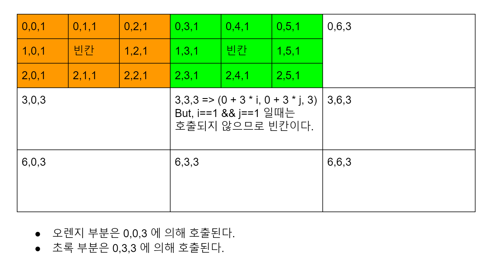

# Recursion

#### 2020-05-13 
1. [팩토리얼 구하기](../src/com/gahee/algorithms/baek/P10872.java) 
    * 0! = 1 이라는 부분을 적절히 처리해 주어야 한다. 
```
   private static long factorial(long n) {
        if(n <= 1) { //n==1 이라고 써서 에러남 ...
            return 1;
        }
        return n * factorial(n-1);
    }
```

2. [피보나치 수 구하기](../src/com/gahee/algorithms/baek/P10870.java)
    * 재귀로 풀이

3. [별찍기](../src/com/gahee/algorithms/baek/A2447.java)
    * 분할정복으로 푸는 것인데 ... 정답을 봐도 잘 모르겠다.
    
* 2차원 배열의 length 
    * `arr.length` 하면 행의 길이가 나옴. 
    * `arr[row].length` 하면 열의 길이가 나옴. 
    
* `Arrays.fill()`

```
arr = new char[n][n];

for (int i = 0; i < arr.length; i++) {
    //각 행을 돌면서 i 번째 행의 모든 열을 빈 문자로 채운다. 
    Arrays.fill(arr[i], ' '); 
}
```


    
#### 2020-05-14 
4. [하노이 탑]() 
 

