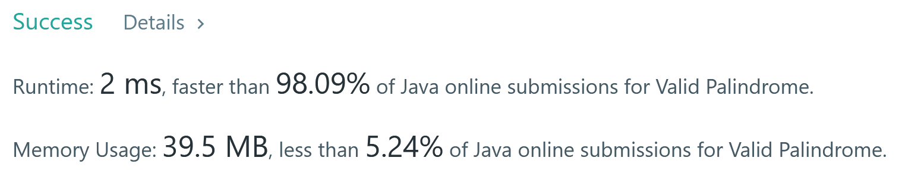

# Today I Learned (Details)
백준 단계별 문제풀이의 문자열 파트

#### 2020-05-12

* String 을 계속해서 append 해 나가야 할 때는 `string += string1` 과 같은 방법 보다는 
StringBuilder 를 사용하자. 

```
StringBuilder answer = new StringBuilder();
        int leftNum = -1, rightNum = -2;
        
        for (int n : numbers) {
            if (n == 1 || n == 4 || n == 7) {
                answer.append("L");
                leftNum = n;
        ... 
```
* 카카오 여름 인턴십 문제를 풀어보았다. 한 문제 밖에 제대로 풀지 못했지만, 
그래도 문제를 보니 1년 동안 집중해서 공부하면 될 수 있을 것이라는 확신이 들었다. 
정해진 계획들을 잘 따라서 앞으로 정말 열심히 한 번 해봐야지. 
0. 그나마 쉽게 풀었던 문제 ... [전화번호 누르기 문제](../src/com/gahee/algorithms/kakao/DialPad.java)

1. [ASCII 숫자로 출력하기](../src/com/gahee/algorithms/baek/P11654.java)
    * BufferedReader 는 읽는 것들을 character 로 변환한다는 것을 두 달 전에 써놨건만 또 까먹고 문제를 이상하게 풀었다.
2. [들어온 숫자들을 합해서 출력하기](../src/com/gahee/algorithms/baek/P11720.java)
    * char 과 같은 primitive type 들은 int 로 변환하는 메서드를 갖고 있지 않다. 따라서 int로 형변환을 한 후에 얻은 아스키 코드 값에서 
    48을 빼주어야 원래의 int 값을 얻을 수 있다. 
    
```
for (int i = 0; i < N; i++) {
            K = (int)numbers[i] - 48;
            answer += K;
        }
```

3. [알파벳이 들어있다면 찾은 위치 출력하기](../src/com/gahee/algorithms/baek/P10809.java)
    * ASCII 값으로 소문자 a 는 97 이고 z 는 122 이다. 
    * 총 26개의 알파벳이 있다. 
    * 중복될 경우에도 첫 인덱스를 갖고 있도록 하기 위해서 Map.contains() 를 사용했다. 
    * 처음에 ArrayList 를 쓸지, Array 를 쓸지 잘 정하고 사용하자. 되돌아 가야 하는 경우에 많이 헷갈린다. 

```
for (int i = 0; i < 26; i++) {
            System.out.print(input.indexOf((char)(i+97)) + " ");
        }
```

* **위와 같이 `String.indexOf()` 를 사용하면 정말 한줄로 풀 수 있는 문제였다.** 

4. [주어진 횟수만큼 반복해서 출력하기](../src/com/gahee/algorithms/baek/P2675.java)
    * 특별히 어려운 문제가 아니었다.
    
5. [가장 많이 등장한 문자 출력하기](../src/com/gahee/algorithms/baek/P1157.java)
    * 만약 제일 많이 등장한 문자가 여러개인 경우 '?' 를 출력해야 한다. 
    * 여러개였을때 어떻게 처리할지 고민을 좀 했다. 처음에는 같은 경우 boolean isEqual 을 true 로 만들고 
    밑에서 출력할때 이 boolean 값에 따라 출력하도록 했는데, 뒤에 더 많이 반복되는 문자가 나올 수 
    있는 경우를 미처 생각하지 못한 사고였다. 그래서 문자의 끝까지 비교할 수 있도록 하고, 최종적으로 
    charMax 가 뭔지에 따라 출력하도록 바꾸었다. 
    
```
input = input.toUpperCase();

        int arr [] = new int[26];
        int max=0;
        char result = '?';
        for(int i=0; i<input.length(); i++){
            // 문자의 위치에 맞게 배열의 인덱스를 1 증가 
            arr[input.charAt(i) - 65]++;
            // 해당 인덱스의 요소가 max 인지 판별 
            if(max < arr[input.charAt(i)-65]){
                max = arr[input.charAt(i)-65];
                result = input.charAt(i);
            }
             //만약 max 와 값이 같다면 result 를 '?' 로 지정한다. 
            else if(max == arr[input.charAt(i)-65]){
                result ='?';
            }
        }

        System.out.print(result);
        
```

* 중복 제거에 집착해서 굳이 Map 을 사용할 필요는 없었다. 다른 정답을 보니 위의 방법처럼 하여 메모리를 훨씬 적게 사용하였다. 
물론 시간은 내 방법이 조금 더 빠르긴 했다. 
* 알파벳이 26개 이므로 원소 26개짜리 배열을 만든다. 만든 후 -65 를 해서 알파벳 순서에 맞게 배열의 인덱스를 가리킬 수 있게 한다.


#### 2020-05-13 

6. [문장 안의 단어의 개수 세기](../src/com/gahee/algorithms/baek/P1152.java)
    * 공백을 제거하는 것이 핵심이다. 
    * trim() 을 사용해서 앞뒤 공백을 제거한 후 split 을 공백 단위로 해서 만약 
    배열에 빈 문자열이 들어있다면 ArrayList 에 추가하지 않도록 걸러냈다. 

* 더 나은 방법 : StringTokenizer 

```
 /**
     * Constructs a string tokenizer for the specified string. The
     * tokenizer uses the default delimiter set, which is
     * <code>"&nbsp;&#92;t&#92;n&#92;r&#92;f"</code>: the space character,
     * the tab character, the newline character, the carriage-return character,
     * and the form-feed character. Delimiter characters themselves will
     * not be treated as tokens.
     *
     * @param   str   a string to be parsed.
     * @exception NullPointerException if str is <CODE>null</CODE>
     */
    public StringTokenizer(String str) {
        this(str, " \t\n\r\f", false);
    }
```
* **String Tokenizer 는 자체적으로 delimiter 캐리터들을 정해놓고 있다. 
스페이스, 탭, 뉴라인, 캐리지 리턴 과 같은 캐릭터들은 토큰으로 취급되지 않는다.** 
* 따라서 아래와 같이 Tokenizing 을 하면 단어들만 걸러낼 수 있다. 
* cf. **캐리지 리턴** : 간단히 리턴이라고 함. 문자의 새 출을 시작하는 데 쓰이는 제어문자. 
아스키와 유니코드에서 캐리지 리턴은 13 으로 정의되며 ctrl + M 을 통해서도 볼 수 있다. 
C언어 에서 `\r` 은 이 문자를 가리킨다. 

```
  StringTokenizer st = new StringTokenizer(input);
        int a = 0;
        while(st.hasMoreTokens()){
            st.nextToken();
            a++;
        }
        System.out.println(a);
```
* 또한 개수를 세주는 것이기 때문에, 만약 처음 인풋이 빈 문자열이면 빠르게 리턴해 줄 수 있도록 
하는 코드를 추가할 수 있다. 

```
	if(input.isEmpty()) {
			System.out.println(0); 
            System.exit(0); 
		}
```
* 새로운 ArrayList 를 도입해서 .size() 를 할 필요도 없었다. 아래와 같이 그냥 
int 값을 증가시키고 이를 출력해 주어도 충분한 문제였다. 
```
int answer = 0; 
        for (String s : splitInput) {
            if (!s.isEmpty()) {
                answer++; 
            }
        }
        System.out.println(answer);     
```

7. [숫자 두 개 뒤집었을 때 더 큰것](../src/com/gahee/algorithms/baek/P2908.java)
    * StringBuilder 의 .reverse() 함수를 사용했다. 
    * **대소비교는 Math.max() 를 사용하면 훨씬 더 깔끔해진다.**
    
8. [전화를 거는 데 걸리는 시간 구하기](../src/com/gahee/algorithms/baek/P5622.java)
    * dial 이라는 2차원 배열을 만들어서 해당 숫자, 전화 거는데 걸리는 시간, 대응하는 문자의 마지막에 대한 정보를 담았다. 
    * 다른 정답을 보니 하드 코딩해서 엄청난 양의 switch - case 문을 만들었던데 ...
    
9. [크로아티아 알파벳 걸러내기](../src/com/gahee/algorithms/baek/P2941.java)
    * 처음에는 Set 에 담아서 String.contains() 로 걸러내려 했는데, "dz=" 와 "z=" 의 우선순위 
    설정이 필요해서 순서가 있는 ArrayList 에 담아서 했다. 
    * 굳이 ArrayList 말고 그냥 배열을 사용했어도 되었다.
    * String.replaceAll() 로 해당 문자가 담긴 곳은 모두 "!" 라는 문자 하나로 치환하고, 
    마지막에 남은 문자열의 길이를 정답으로 반환한다.
    
10. [그룹 단어의 개수 출력하기](../src/com/gahee/algorithms/baek/P1316.java)
    * 요즘들어서 Map 에 꽂혔나보다 ... 중복 제거 - Map 쓰자! 이렇게 사고방식이 흘러간다. 
    * 다른 정답을 찾아보니 Map 구조를 쓰지 않고도 연이은 문자인지 확인하는 방법이 있다는걸 알게 되었다. 
        * StringBuilder 에다가 문자를 일단 append 하고, 검사 대상 문자가 문자열 안에 들어가 있다면 
        해당 문자의 인덱스가 StringBuilder 의 길이 - 1 과 같은지 다른지 검사하는 방법이 있다. 
        * 만약 연이어 있지 않으면 그룹 단어가 아니므로 boolean isGroup 을 false 로 해준다. 
    
    
#### 2020-10-21 

## Palindrome 

#### Watch out for alphanumeric hits!
* alphanumeric 이라면, `[a-zA-Z0-9]` 인 것들을 뜻한다. 따라서 이들이 아닌 것들을 "" 로 replace 하고 싶으면, 다음과 같은 연산을 
사용할 수 있다.  

```java
String.replaceAll("[^a-zA-Z0-9]", "") 
```

* 아스키 번호로 걸러내고자 하는 경우에는 97~122 번이 아닌 것들, 48 ~ 57 번이 아닌 것들을 걸러내면 된다.  

```java
if (ascii <= 122 && ascii >= 97) {
    stringBuilder.append((char) ascii);
}else if(ascii >= 48 && ascii <= 57){
    stringBuilder.append((char) ascii); //numeric characters
}
```

#### Stack solution 

* 유효한 알파벳들을 걸러낸 이후에는 이 단어가 회문인지 알아내야 한다. 
* 나이브한 솔루션으로는 스택을 써서 
    1. 모든 단어들을 스택에 넣고 
    2. 주어진 단어와 스택에서 pop() 한 단어를 비교하여 회문임을 판별한다. 
    
#### Two-pointer solution 

* 스택 객체를 사용하는 것은 객체가 갖는 기본적은 16바이트 오버헤드 외에, 속도를 저하시키는 요인들이 있다. 
예를들어, 스택에 모두 담으려면 적어도 O(N) 만큼 배열을 다 순회해야 한다. 
* 좀 더 효율적인 방법으로는 두 개의 left, right 라는 변수를 두고, 이를 포인터로 삼아 양 끝에서 가운데로 이동하며 
배열을 요소들을 비교하는 방법이 있다. 
* 투포인터를 사용하면 유효한 알파뉴메릭 캐릭터를 걸러서 새로운 String 을 만드는 작업 또한 불필요하다. 
(물론 스택 구현에서도 비슷한 방법을 쓸 수 있겠으나.) 
* 양 끝의 단어들을 비교하는 데, 이 때 한 쪽의 끝이 알파뉴메릭이 아니라면 그냥 다음 단어로 넘어간다. 
두 단어들이 모두 비교 가능한 알파뉴메릭 단어일 때 같은 단어인지 판별하고, 아니라면 false 를 반환한다. 

#### Two pointer 예시 



```java
public static boolean isPalindromeTwoPointer(String s){
    int left = 0;
    int right = s.length() - 1;
    s = s.toLowerCase();

    while(left < right){
        if(!isAlphaNumeric(s.charAt(left))){
            left++;
            continue;
        }
        if(!isAlphaNumeric(s.charAt(right))){
            right--;
            continue;
        }
        //they are now both alphanumeric characters.
        if(s.charAt(left) != s.charAt(right)){
            return false;
        }
        left++;
        right--;
    }
    return true;
}

public static boolean isAlphaNumeric(char c){
    return (c >= 48 && c <= 57) || (c >= 97 && c <= 122);
}
```

* 구현시 주의할 것 
  * 반드시 continue 를 넣어주어야 한다. 안그러면 밑의 if 문 까지 다 실행되버림. 